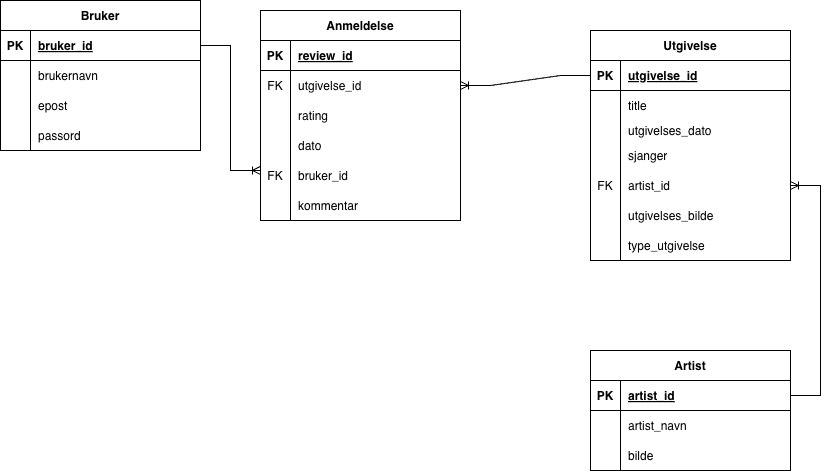

# overskrift 

Min ide!
Jeg tenker å lage en tjeneste hvor man kan anmelde album og singler offentlig

## Tjenesten skal inneholde 
- Innloggingsystem for å kunne opprette en egen bruker
- Lister for å f.eks. kunne legge til alle mine favoritt tekno album, eller de beste singlene i 2026 så langt
- Muligheten til å anmelde en musikk

## Hva sider skal denne tjenesten vise?
- Startside: Skal gi deg muligheten til å opprette bruker, eller logge med en allerede laget bruker
- Nav bar: Skal inneholde "Hjemmeside", "Profil", "Anmeldelser", "Venner", "Dine lister"
- Hovedsiden: Her skal ny musikk ligge. Her vil jeg at både ny musikk av populære artister skal ligge, og ny musikk fra artister som du følger (vil helst at det skal være artister som du ofte hører på, men da må jeg gi muligheten til å koble til spotify/apple musik)
- Anmeldelser: Her skal du kunne se dine tidligere anmeldelser og venner siden anmeldelser. 
- Venner: Her vil det ligge en liste over alle brukere du følger. Det vil også komme opp reccomended brukere, som er da brukere som har mange følgere, eller/og anmelder mye av den sammen musikken som deg
- Dine lister: Her skal du kunne opprette egne lister, både private og offentlige 
## Krav til min tjeneste 
Jeg trenge å opprette noen krav, slik at jeg kan danne en best mulig datamodell 

- En profil kan skrive flere anmeldelser
- En anmeldelse tilhører kun en bruker
- Et album og en singel kan bli anmeld av flere brukere

- En artist kan ha produsere flere album og singler
- Et album og en singel kan ha flere artister 
- Et album kan inneholde flere sanger

- En bruker kan opprette flere lister
- En liste tilhører bare en bruker 
- Brukeren kan legge til flere album og sanger i listene
- Album og sanger kan være lagt til i flere lister

- en bruker kan følge flere brukere (venner)
- en bruker kan bli fulgt av flere brukere (venner)
- en bruker kan ikke følge seg selv

Kommentar
- En profil må beste av et brukernavn, passord, email
- En anmeldelse kan inneholde, rating, dato og tekst
- I en anmeldese kan en bruker anmelde enten et album eller en singel. I en anmeldelse kan man kun anmlede en av delene 
- Et album og en singel bestpr av tittel, utgivingsdato, sjanger

 # Underveis dokumentasjon
 ## Teknologi som er brukt

I dette prosjektet har jeg måtte brukt, samt lært masse om hva og hvordan teknologien gjør det mulig å skape denne tjenesten

## Backend

### Node.js
 Node.js er «Runtime system» -et til JavaScript. Før Node.js, når man skulle opprette en tjeneste som besto av en frontende og en backende, altså en nettside som kommuniserte med serveren, kunne ikke JavaScript gjøre dette aleine. Det krevdes andre programmeringsspråk. Med node.js kunne du lage webapplikasjoner som har en backend som kommuniserer med frontende. 
 
#### Npm
 Dette kan man sammenligne med en verktøyskasse. Npm består av mange tusen «open source librabies» , og på den måten gjør det å kode enklere, ettersom det gir oss muligheten til å hente ekstrerne bibloteker og pakker.
 
#### Avhengigheter
 Vi laster ned, gjennom npm, videre avhengigheter for å kunne opprette våres web-applikasjon. Vi laster ned ‘Express’, ‘Better-sqlite3’ og 'CORS’
 
#### Express
 Express gir oss muligheten til å ta i bruk et robust ‘Routing system’. Vi kan bruke express til å definere hvordan web-applikasjonen reagerer, som i min kode har jeg brukt GET  og POST. De to gjør ulike ting, hvor GET henter data fra databasen og viser det på nettsiden, mens POST sender inn data i databsen

 #### CORS
 CORS er en avhengighet vi lastet ned, og fungerer som en sikkerhets mekanisme. CORS gir forntenden muligheten til å kommuiserene med backenden, også vica versa. 
 
## Lagring 

#### Better-sqlite3
 Avhengigheten ‘better-sqlte3’ er den nyeste versjonen av denne avhengigheten, og gir oss muligheten til å kommunisere med sqlite.
 
 Jeg lagrer databasen jeg opprettete i SQLiteStudio i samme repositorien min, og ved hjelp av Better-Sqlite3 har jeg muligheten til å sende inn data og hente ut data
 
## Frontend
#### Universell utforming UU
 Når det kommer til utforming har jeg brukt **HTML5**, CSS3 og JavaScript, hvor HTML5 er den nåværende staderd versjonen av HTML, som intodusere flere semantiske elemementer som header, footer og article. I min kode har jeg valgt å ta i bruk semantiske emelenter som beskriver inneholdet. Jeg har valgt å bruke beskrivede semantiske tagger for å gjøre koden mer tilgjengelig for alle. For eksempel vil bilde eller andre med sysnavsker være avhengig av for eksmpel skjermlesning. For at alle skal ha muligheten til å navigere seg rundt på nettsiden er det viktig å velge meningsfulle semantiske elementer, som header, nav og main. 

Jeg har brukt **CSS3** for å style applikasjonen med fokus på et intuitivt grensesnitt og universell utforming (UU). 
For å presentere album og artister har jeg brukt display: grid med repeat(auto-fill). Dette gjør at antall kort i bredden tilpasser seg skjermstørrelsen automatisk. Ved å kombinere dette med relative enheter som rem og %, fungerer tjenesten på både mobil og PC uten at innholdet blir for smått eller for stort. Jeg har valgt farger med høy kontrast, som mørk tekst på lys bakgrunn, for å sikre at innholdet er lesbart for alle. Dette er i tråd med WCAG-kravene om et kontrastforhold på minst 4.5:1. For å gjøre grensesnittet intuitivt, har jeg lagt til en enkel løfte-effekt når brukeren fører musen over et album eller en artist. Dette gir en direkte bekreftelse på hvilket element som er aktivt. For brukere som navigerer med tastatur, har jeg lagt til en tydelig gul outline på knapper og input-felt. Dette er et viktig UU-tiltak som gjør det enkelt å se hvor man befinner seg på siden uten bruk av mus. Jeg har også lagt på en  skygge (box-shadow) for å skape visuell dybde og skille bildene tydelig fra bakgrunnen. Også for å støtte skjermlesere, genereres bildebeskrivelser (alt-tekst)

 #### SEO
 Ved bruk av gode semantiske elemnter kan søkeroboter, som google bruker, forstå inneholde bedre, noe som kan gjøre mer synlighet i søkeresultater
 #### Sammerbeid blir lettere
 Når andre utviklere skal ta over koden, vil koden være mer fortåelig for andre hvis vi bruker beskirvende semantiske taggere i stedet for mange div elementer. Dette kan også gjøre koden vansklige å tolke

 # Datamodell
 
 ## Datamodellen designet i draw.io

;
 Jeg har delt systemet i fire tabeller. Dette er på en måte første utkast, og er ikke, nærheten til å være ferdig fylt ut, men det er et bra første utkast. Datamodellen har tre relasjoner, og derfor oppfyller minste kravet 
 
 - Bruker: Lagrer informasjon om dem som anmelder
 - Artist: Inneholder enkel informasjon om artister
 - Inneholder informasjon om spesifikke album eller singler, knyttet til en artist
 - Anmeldelse: En sentral tabell som knytter sammen en bruker og en utgivelse med en rating og en tekstlig kommentar.
 
 ## Relasjoner: 
 I modellen er det to ulike relasjoner som oppstår
 
 En til en (1:N) mellom artister og utgielser, ettersom en artist kan ha mange utgivelser, og en utgivelse kan kun en artist. Det er et krav jeg har valgt for denne oppgaven for å slippe et mange til mange forholdt 
 
 Forholdet mellom bruker og utgivelse er et mange til mange forhold, ettersom en bruker kan anmelde mange utgivelser, og en utgivelse kan bli anmeldt flere ganger. Jeg løser dette problemet med å opprette en koblingstabell, ‘Anmeldelse’ som gir hver ny anmeldelse en egen id. 
 
 Tabellen Anmeldelse inneholder fremmednøkler (FK) fra begge de andre tabellene. Den henter bruker_id fra Bruker. Den henter utgivelses_id fra Utgivelse. I tillegg lagrer den data som er spesifikke, som rating, kommentar og dato
 
 Mellom Bruker og Anmeldelse blir det en ting mange forhold (1:N), hvor en bruker kan skrive felere anmeldelser, men en anmeldelse tilhører bare en bruker. Det samme gjeler forholden mellom Anmeldelse og Utgivelse, hvor en utigvelse kan ha mange anmeldelser, men hver anmeldelse er kun knyttet til en utgivelse
 
## Normalisering:
 Ved å skille dette ut i en egen tabell, følger jeg reglene for normalisering. Jeg slipper å lagre brukernavnet på nytt hver gang noen skriver en anmeldelse.
 
### Opprette databasen i SQLiteStudio 
 
 Videre skrev jeg inn alle tabeller og kolloner ut ifra datamodellen. Jeg lå samt inn test data. 
 
 På denne tiden viste jeg ikke at jeg sto ovenfor et problem. Jeg velger å skrive det her, i stedet for lengre nede i dokumentet hvor jeg beskriver andre utfordringer, ettersom det er i databasen jeg måtte ta en avgjørelse. 
 
 Problemet som oppstå var når jeg skulle opprette POST ruteren. Her var målet å kunne skrive inn en anmeldelse også få den lagret i anmeldelse tabellen, som da er tom, og klar for å ta i mot data.
 
 Det som skjer, er at databasen ikke lagrer dataen jeg sender inn. Dataen, altså det jeg skrevet i skjemaet, anmeldelsen, blir skrevet ut i terminal.  Jeg ser i databasen, og ser at anmeldelse har fremmednøkklene «bruker_id» og «utgivelses_id», som jeg tror skapet et problem. Siden det er ingen innloggings side, enda, vil bruker_id ha null data. 
 
 Det som skjer er at dataen som skjemaet for inn blir ikke sendt inn, selv etter daten blir sendt korrekt ut. Jeg forstå at problemet må ligge hentingen av daten. Problemet lå i bruker_id. Anmeldelse tabellen forventer bruker_id for å koble anmeldelsen send til en bruker. Bruker_id er oblegatorisk, og ettersom innloggingsystemet mangles foreløbing, vil SQLite sende ut: Foreign Key constraint failed
 
### Hvordan velger jeg å løse dette: 
 Jeg har valgt å fjerne bruker kolonnen fra databasen. Dette er noe jeg kan forhåpentligvis legge til i seinere tid når jeg har fått på plass innlogging, men nå lager det unødvendig trøbbel.
 
 Jeg for til å sende data inn i databasen, som vil si at jeg har fått til en kommunikasjon mellom frontende og bakenden! Jeg ser tydelig at data som sendes inn lagres, og jeg må refreshe for å få opp ny data lagt inn. Jeg sletter ved å trykke på knappen ves siden av commit. 
 
 En annen løsing kynne vært å hardkode inn en slagst test bruker, for å så kunne beholde bruker kolonnen uten et ferdig innlogginsssytem. Dette kunne vært bra for å koble anmeldelser til en bruker, samt negativt, ettersom hver anmeldelse ville vært lagret på samme bruker
 
 ## API endepukt
 I min kode har jeg opprettet 3 Api-endepunkt. Api-endepunktene er backenden og er den som frontendenden kommuniserer med for å nå databasen. 

 Jeg opretter oppretter en mappe i roten av koden, med navnet rutere. Denne mappen inneholder en fil som heter ruter.js, hvor alle ruterene jeg har opprettet ligger der. Grunnen til at jeg lagt ruter.js i en egen mappe er for å holde orden på hvor jeg har filen med ruterene, og hvis jeg ønsker å utvide programmet mitt, og dermed er nøtt til å opprette veldig mange rutere, kan jeg opprette flere ruter filer i denne mappen

 Grunnen til at jeg valgte å seperere ruterene fra app.js, som er filen hvor orginalt alle ruterene lå er for å holde denne filen så ryddig og oversiktlig så mulig.

 app.js inneholder flere sentrale linjer som er nødvendig for at koden skal fungere. Jeg ønsker at hver fil, for å hold mest mulig orden, gjør en spesefik ting, hvor hvis app.js skulle bestått av ruteren også, ville app.js hatt mange ulike oppgaver, vært lang og uoversiktlig, noe som gjør det vanskligere å finne f.eks. feil. Jeg har samt opprettet en database.js som gir meg muligheten til å lett koble på nye databaser. Jeg kan på denne måten få koden min til å bli så modulært og organisert som mulig

#### ruter.js
Det er her alle rutene jeg oprette ligger. I toppen av koden definerer jeg tre variabler, som er viktige for at jeg skal kunne i det hele tatt oprette rutere. 

- const express = require('express'); her sier jeg at variabelen 'express' krever avhengigheten express
- const router = express.Router(); ved å skrive denne linjen gir det oss muligheten til å opprette et ruter-objekt. 
- const db = require('../database'); dette er stien til database.js, som er filen som kobler oss til databasen våres (musikk.db)

**/api/hente_alle_album** er skrevet slik pga:

Jeg oppretter en api og sier at den apien fungerer kun når vi skal hente noe. Det skyles at jeg bruker GET, et verktøy som kommer fra Express, som gir oss muligheten til å hente data.

variabelen album består av en spørringing til databsen, og vi sier db.prepare, vil si på en måte at vi gjør ruteren klar til å brukes/klar til å kommunisere med databasen. .all() gjør slik at alt blir sendt, og at det kommer i en array. 

res.json(album) forteller at arrayn skal sendes som sendes som en string. Grunnen til det er at over internett så kan man kun sende som en string

**skriv om feil mld her anne!**

**/api/skriv_anmeldelse** er skrevet slik pga :

Denne er anderledes, og man ser det tydlig etter ruteren er betydlig lengre. Denne ruteren krever data som den skal sendes inn i musikk.db 

vi burker router.post og opprettet navn for Api-endepunktet. Vi sier videre at dato, kommentar, rating, utgivelses_id, en liste med variabler er definert som req.body. Hvorfor? 

req.body er en slags pakke som inneholder informasjon fra frontenden. I skjemat som vi fyller ut i nettsiden, anmeldelsen, som snedes inn, skriver vi inn data. Dataen sendes på en måte over nettverke, fra frontenden til backenden

vi oppretter variabelen 'leggTil' som gjør dataen som kom inn, klar for å sendes inn i tabellen 'anmeldelse' i databsen. Vi skrives values ???? som slags 'placeholders'
Videre skriver vi leggTil.run, hvor run er en funksjon som vi bruker når vi gjør endringer i en database

 ## Beskrivelse av frontende

backendene, altså ruterene, skal kommunisere med frontendene. Api-endepunktet 'kjøres' når vi bruker fetch('valgt_api-endepunkt'), og det er på denne måten frontenden kommuniserer med backenden. 
I koden har jeg tre ulike sider, som skal etter hvert ha en sammenheng. 

### "hvilke sider, hva de gjør, og hvordan de kommuniserer med backend"

#### Side 1 - Alle relevante album
Denne siden skal vise frem alle relevante album, hvor det som egentlig skjer er at det hentes informasjon fra databasen og til nettsiden, altså klient siden.

Frontenden her, fetch, kommuniserer med backenden, ved at fetch kaller på api-endepunktet. Fetch er asyncron, som vil si at koden er fremdeles oppe å går og fungerer helt til den for svar. Api-endepunktet består av en spørring, hvor i denne sammenhengen spør spørringen etter all infomrasjon fra 'utgivelser' tabellen i databsen. Når ruteren mottar dataen kommer den tilbake i en array, før den gjøres om til en json string, ettersom det kreves når vi sender noe over nettet, før når fetch mottar dataen så gjør den det om til en array igjen. Dette kalles serialisering.

#### Side 2 - Alle relevante artister
Denne siden er ikke fullført, hvor ønsket resultat ville vært at når du trykker på et album ville du hatt muligheten til å både anmelde et album, samt besøke artisten som produserte albumet sin profil. 

Denne siden kommunserer helt likt med backenden som side 1, ettersom de begge to bruker GET, altså henter data, ved hjelp av å kalle på et api endepunkt.

#### Side 3 - Skrive anmeldelse 
Formålet med denne siden er at det skal gi brukeren muligheten til å skive en rating og kommentar til et album eller singel. Denne siden litt anderledes, og det er med komplisert. 

Denne har en lytte funksjon som kalles på når skjemaet sendes inn. window.location.search henter ut det som står etter spørsmålstegnet. Så når jeg trykker på et album jeg ønsker å anmelde, vil jeg bli sendt til en ny adress som vil se slik ut. 

/anmeldelse/index.html?utgivelses_id=3
her vil, avhengig av hv aalbum jeg har trykket på, og ønsker å anmelde, vil det stå iden til utgivelsen. I dette eksmeplet står det utgivelse_id = 3, på grunn av at vi trykket på det albumet med id 3. 

Vi gir variablene dato, kommentar, rating verdien av det som skrives inn i skejmaet. Datoen som vi legger inn for anmeldelsen vil være verdien dato for. Jeg kjekker i consollen og ser at dataen skrevtet inn er lagret i ved de riktige variablene. 

dataen som skal sendes inn, sendes inn når vi sender inn skejmaet, grunnet til at da kjører fetch, så da altså kaller på API-endepunktet. 

    Som forklaring lengre opp, vil dette API-endepunktet sender data inn. Her er det beskrevet at data med navn 'dato, kommentar, rating, utgivelses_id', skal sendes inn i databasen. Så når 

